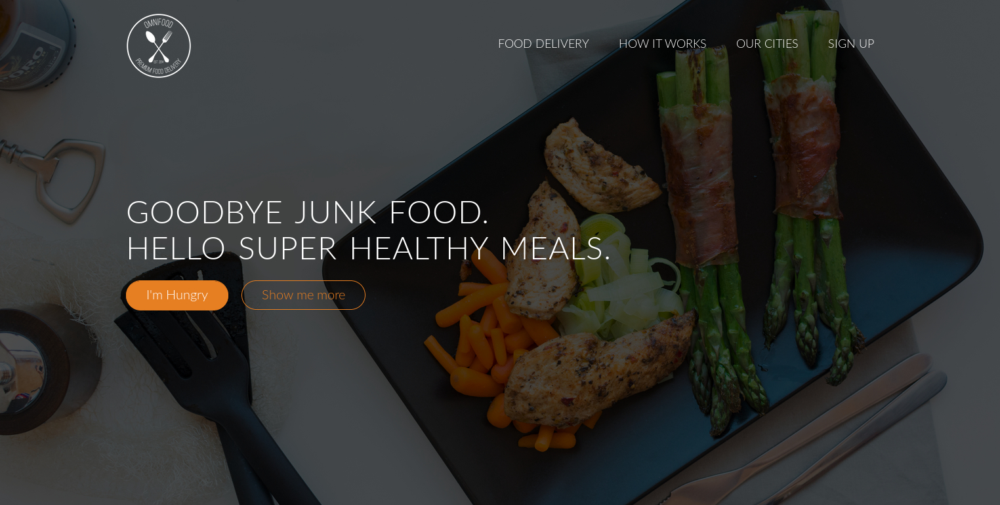

# Responsive Web project

## Live Host

The project is hosted on http://karanagarwal.me/responsive-web-project.

## Description

This is a fully responsive front-end static website designed for an imaginary food delivery start up named Omnifood.

It has many sections.

* features - to display the important features about the startup
* meals - to show some images of the menu items available
* steps - steps required to download their webapp
* cities - to tell the cities they are available in
* reviews - to showcase the customer reviews.
* plans - displaying the different plans they offer
* contact - serves as a medium to let people contact them

The above image is from the project.

## Technologies Used

* HTML/CSS
* JavaScript
* Jquery
* Animate
* Grid
* Waypoints
